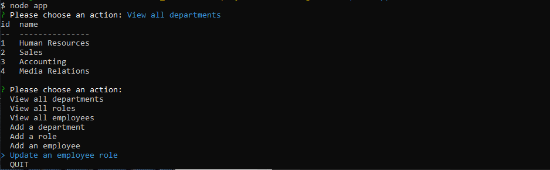

# Company-Database-Manager-Tool

## Description
A node.js application that allows a user to interact with their MySQL database based off of basic commands. The application allows you to view database information, as well as add and update it easily.

## Video Demo Link
https://www.youtube.com/watch?v=bpXyNIwY8Ls